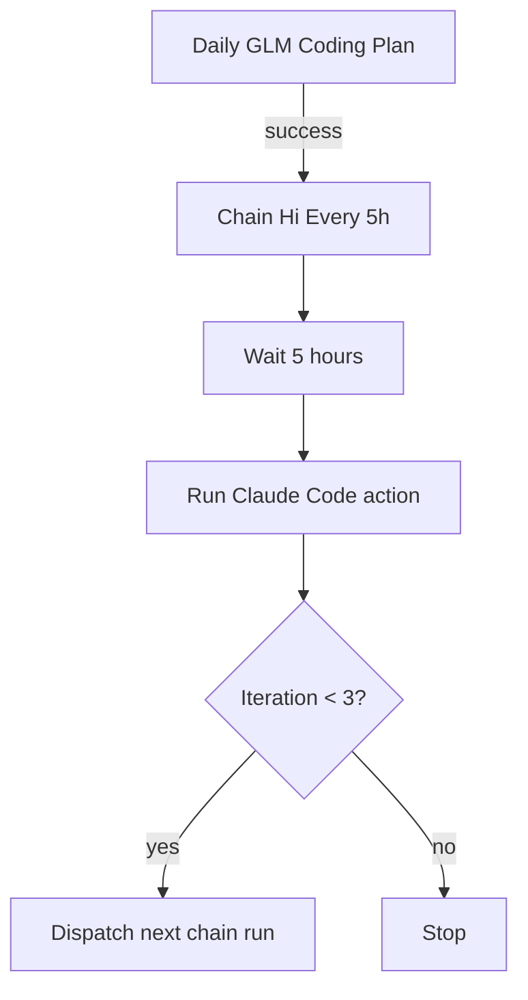

# Daily Renew Coding Plan Workflow

[简体中文](./README.zh-CN.md)

This repository is a minimal GitHub Actions setup for running a daily Claude Code task against a GLM-compatible endpoint, then optionally chaining additional follow-up runs every 5 hours.

At the moment, the repository contains only workflow files under `.github/workflows/`, so this README documents how the automation is wired and what you need to configure before using it.

## What This Repository Does

- Runs a scheduled workflow named `Daily GLM Coding Plan`
- Calls `anthropics/claude-code-action@v1`
- Uses a custom Anthropic-compatible base URL and auth token from repository secrets
- Uses `glm-4.7` as the configured model
- Starts a second workflow after the daily run finishes successfully
- Waits 5 hours between chained runs and repeats up to 3 iterations

## Workflow Overview



## Repository Structure

```text
.github/
  workflows/
    start-claude-code-daily.yaml
    chain-hi-every-5h.yaml
```

## Workflows

### 1. `Daily GLM Coding Plan`

File: [`.github/workflows/start-claude-code-daily.yaml`](./.github/workflows/start-claude-code-daily.yaml)

Purpose:
- Runs on a daily schedule
- Can also be started manually from the GitHub Actions UI
- Executes `anthropics/claude-code-action@v1` with the prompt `hi`

Current configuration:
- Cron: `30 7 * * *`
- Timezone: `Asia/Shanghai`
- Model: `glm-4.7`
- Prompt: `hi`

Notes:
- GitHub scheduled workflows run on the repository's default branch.
- The current prompt is only a placeholder. Replace it with your real daily coding or planning prompt before production use.

### 2. `Chain Hi Every 5h`

File: [`.github/workflows/chain-hi-every-5h.yaml`](./.github/workflows/chain-hi-every-5h.yaml)

Purpose:
- Starts after `Daily GLM Coding Plan` completes successfully on `master`
- Can also be started manually with `workflow_dispatch`
- Sleeps for 5 hours
- Runs the same Claude Code action again
- Dispatches itself again until iteration `3`

Current behavior:
- Trigger source: `workflow_run` from `Daily GLM Coding Plan`
- Manual input: `iteration`
- Delay between chained runs: `18000` seconds
- Maximum iterations: `3`
- Job timeout: `360` minutes

Notes:
- The branch filter is currently `master`, so the chained workflow assumes the repository default branch is also `master`.
- The chained workflow uses `GITHUB_TOKEN` with `gh workflow run ...` to start the next `workflow_dispatch` run.

## Required Repository Secrets

Configure these secrets in GitHub repository settings before enabling the workflows:

- `ANTHROPIC_BASE_URL`
- `ANTHROPIC_AUTH_TOKEN`

The workflows also use the built-in `GITHUB_TOKEN` for dispatching the next chained run.

## How To Use

1. Fork or clone this repository to your own GitHub account.
2. Add the required repository secrets.
3. Update the prompt from `hi` to your real coding-plan prompt.
4. Adjust the model if you do not want to use `glm-4.7`.
5. Review the daily schedule and timezone.
6. Enable GitHub Actions for the repository.
7. Run `Daily GLM Coding Plan` manually once from the Actions tab to verify the setup.

## Customization Guide

### Change the prompt

Update the `prompt` field in both workflow files.

Examples:
- Generate a daily coding plan
- Review yesterday's progress
- Open an issue or pull request draft
- Produce a Markdown report and commit it back

### Change the model

Update:

```yaml
claude_args: '--model glm-4.7'
```

### Change the schedule

Update the cron expression in `start-claude-code-daily.yaml`.

Example:

```yaml
schedule:
  - cron: '0 9 * * *'
    timezone: 'Asia/Shanghai'
```

### Change the chain length or delay

Update these values in `chain-hi-every-5h.yaml`:

- `sleep 18000`
- `default: '1'`
- `if: github.event.inputs.iteration < '3'`

## Operational Caveats

- The repository is intentionally minimal and currently ships no application code, scripts, or generated output.
- The workflows are only useful after you replace the placeholder prompt with a real task.
- The chained job intentionally blocks a runner for 5 hours because it uses `sleep` inside a job.
- Scheduled GitHub Actions runs can be delayed under platform load.
- If you rename the default branch from `master` to `main`, update the branch filter in `chain-hi-every-5h.yaml`.

## Suggested Next Improvements

- Replace `sleep` with a more efficient scheduling strategy if you want to reduce runner occupancy.
- Move the prompt into a tracked Markdown file so prompt edits are easier to review.
- Add an output artifact or commit step so every run leaves an auditable result.
- Add failure notifications for easier monitoring.

## Source References

- [GitHub Actions workflow syntax for `schedule`](https://docs.github.com/en/enterprise-cloud@latest/actions/reference/workflows-and-actions/workflow-syntax)
- [GitHub Actions `GITHUB_TOKEN` behavior](https://docs.github.com/actions/concepts/security/github_token)
- [Anthropic Claude Code Action](https://github.com/anthropics/claude-code-action)
