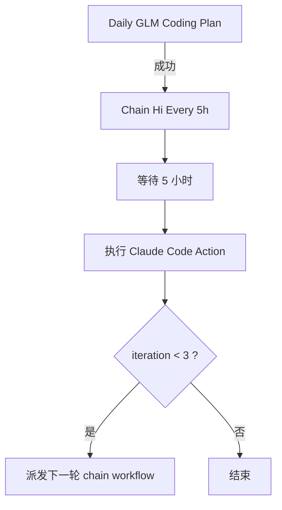

# Daily Renew Coding Plan Workflow

[English](./README.md)

这个仓库是一个极简的 GitHub Actions 自动化仓库，用来通过兼容 Anthropic 接口的 GLM 服务执行“每日 Claude Code 任务”，并在首轮成功后每隔 5 小时继续串联后续运行。

目前仓库里只有 `.github/workflows/` 下的两个工作流文件，没有 README、脚本或业务代码。因此这份文档的重点是把现有自动化链路、依赖配置和后续可改造点说明清楚。

## 仓库当前做什么

- 运行一个名为 `Daily GLM Coding Plan` 的定时工作流
- 调用 `anthropics/claude-code-action@v1`
- 通过仓库 secrets 注入自定义 Anthropic 兼容接口地址与认证令牌
- 当前模型参数是 `glm-4.7`
- 在每日工作流成功结束后触发第二个链式工作流
- 链式工作流每隔 5 小时继续执行一次，最多执行 3 轮

## 工作流总览



## 仓库结构

```text
.github/
  workflows/
    start-claude-code-daily.yaml
    chain-hi-every-5h.yaml
```

## 工作流说明

### 1. `Daily GLM Coding Plan`

文件：[`/.github/workflows/start-claude-code-daily.yaml`](./.github/workflows/start-claude-code-daily.yaml)

作用：
- 按天定时运行
- 也可以在 GitHub Actions 页面中手动触发
- 用提示词 `hi` 执行 `anthropics/claude-code-action@v1`

当前配置：
- Cron：`30 7 * * *`
- 时区：`Asia/Shanghai`
- 模型：`glm-4.7`
- 提示词：`hi`

说明：
- GitHub 的定时工作流只会在仓库默认分支上运行。
- 当前的 `prompt: hi` 明显只是占位内容，正式使用前应替换为真正的每日编程计划、日报生成或自动执行提示词。

### 2. `Chain Hi Every 5h`

文件：[`/.github/workflows/chain-hi-every-5h.yaml`](./.github/workflows/chain-hi-every-5h.yaml)

作用：
- 当 `Daily GLM Coding Plan` 在 `master` 分支上成功结束后触发
- 也支持手动 `workflow_dispatch`
- 先等待 5 小时
- 再运行一次相同的 Claude Code Action
- 如果当前轮次小于 3，则继续派发下一轮

当前行为：
- 触发来源：`Daily GLM Coding Plan` 的 `workflow_run`
- 手动输入参数：`iteration`
- 每轮等待：`18000` 秒
- 最大轮次：`3`
- Job 超时：`360` 分钟

说明：
- 当前分支过滤写死为 `master`，所以仓库默认分支也应为 `master`，否则需要同步修改。
- 这个链式工作流通过 `GITHUB_TOKEN` 调用 `gh workflow run ...` 来继续触发下一轮 `workflow_dispatch`。

## 必需的 Repository Secrets

启用工作流前，需要在 GitHub 仓库设置中配置以下 secrets：

- `ANTHROPIC_BASE_URL`
- `ANTHROPIC_AUTH_TOKEN`

此外，链式派发下一轮时还会使用 GitHub 自动提供的 `GITHUB_TOKEN`。

## 如何使用

1. Fork 或 clone 这个仓库到你自己的 GitHub 账号下。
2. 配置所需的 repository secrets。
3. 把两个工作流中的 `prompt: hi` 改成你真正想执行的任务提示词。
4. 如果不想使用 `glm-4.7`，同步修改模型参数。
5. 检查每日定时的 cron 和时区是否符合你的预期。
6. 确认仓库已经启用 GitHub Actions。
7. 先在 Actions 页面手动运行一次 `Daily GLM Coding Plan` 验证整条链路。

## 可定制项

### 修改提示词

同时修改两个 workflow 文件里的 `prompt` 字段。

例如可以改成：
- 生成每日 coding plan
- 回顾昨天的完成情况
- 自动生成 issue 或 PR 草稿
- 产出 Markdown 报告并提交回仓库

### 修改模型

调整这一行：

```yaml
claude_args: '--model glm-4.7'
```

### 修改执行时间

修改 `start-claude-code-daily.yaml` 里的 cron 表达式。

示例：

```yaml
schedule:
  - cron: '0 9 * * *'
    timezone: 'Asia/Shanghai'
```

### 修改串联轮次或间隔

在 `chain-hi-every-5h.yaml` 中调整这些值：

- `sleep 18000`
- `default: '1'`
- `if: github.event.inputs.iteration < '3'`

## 运行层面的注意事项

- 这个仓库目前刻意保持极简，没有应用代码、脚本目录或运行产物。
- 在你把占位提示词替换成真实任务前，这两个工作流基本没有业务价值。
- 链式工作流通过 `sleep` 占住 runner 5 小时，这种实现简单，但 runner 利用率不高。
- GitHub Actions 的定时任务在高负载时可能延迟。
- 如果你把默认分支从 `master` 改成 `main`，别忘了同步修改 `chain-hi-every-5h.yaml` 里的分支过滤条件。

## 建议的下一步改进

- 如果希望减少 runner 占用，可以把 `sleep` 改成更轻量的调度方案。
- 把 prompt 抽到独立 Markdown 文件中，方便版本管理和审阅。
- 增加 artifact 上传或提交结果的步骤，让每次运行都有可追踪产物。
- 加入失败通知，便于监控。

## 参考资料

- [GitHub Actions `schedule` 工作流语法](https://docs.github.com/en/enterprise-cloud@latest/actions/reference/workflows-and-actions/workflow-syntax)
- [GitHub Actions 中 `GITHUB_TOKEN` 的触发行为](https://docs.github.com/actions/concepts/security/github_token)
- [Anthropic Claude Code Action](https://github.com/anthropics/claude-code-action)
